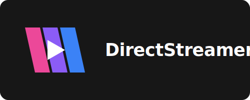

# DirectStreamer

DirectStreamer is a high-performance, containerized streaming solution designed for Android TV, focusing on direct-play playback with enhanced HDR/Dolby Vision support and automated deployment.

why you say? many of the current options have horrible HDR compatablity issues

## ✨ Key Features

*   **Direct Play Architecture:** Minimalistic Player UI with backend serving media files directly to the client.
*   **Miminalistic Interface**
    *   Only show a list of files sorted by latest
    *   Simplified Player UI to be as light as possible
    *   Web Interface at port 8282 with the ability to play files both in browser or on android tv
*   **Enhanced HDR & Dolby Vision:** 
    *   Detect DoVi/HDR10 in media files and automaticly select correct decoder (bypasses android/amlogic)
    *   Disable Dovi 07.06 profiles and force them to HDR10 (fallback=yes)
*   **Smart Playback:**
    *   Throttled streaming to optimize network utilization.
    *   Smart Seek functionality for smooth navigation. (left/right dpad to seek)
    *   Real-time subtitle and audio track cycling. (up dpad to cycle audio track, down dpad to cycle subtitles)
*   **Automated Deployment:** Seamless "One-Click" build and install process using Docker and ADB (Android Debug Bridge).
*   **Debug Monitoring:**
    *   Automatic detection of HDR10, HLG, and various Dolby Vision profiles via `ffprobe` in docker logs
    *   Built-in monitoring for LG OLED TVs to track HDMI input formats and signal changes in real-time in docker logs
    *   Built-in monitoring for Logcat directly to your Docker logs
    *   Persistent storage for TV/ADB authentication keys and configuration.

## Notes
* Very much a work in progress
* Am not a coder, ive used Gemini AI but feel free to help improve it tho, there is a reason why ive released it under GPLv3

## Tested Hardware
* * Mostly tested on my [Xiaomi TV Box S (3rd Gen) aka Twilight ]([url](https://www.androidtv-guide.com/streaming-gaming/xiaomi-tv-box-s-v3/))
 

## 🚀 Getting Started

on your android tv device
1. Enable ADB or MiTV adb Debugging under Developer Options, it shows up after you press about 7 times on Android TV Build in About under Settings > System > then it should show up under Settings > System or Quick Settings Menu  

on your server
* `apt-get install docker.io docker-compose-v2 nano` (Ubuntu)
* `git clone https://github.com/nwgat/DirectStreamer && cd DirectStreamer`
* `nano .env`
* change `TV_IP=192.168.1.239` to your android tv device
* change `BACKEND_IP=192.168.1.2` to your docker host machine ip
* change `ADB_INSTALL=yes` to auto install on your android tv device
* if you have a LG OLED TV you can change `HDMI_CHECK_IP=192.168.1.122` to it

## Todolist, Known Issues List
- [x] release the code
- [x] hope stability works out with high bitrate files
- [x] Web Interface for backend with playback/browse
- [x] Web Interface has custom url option and a menu now
- [ ] fix wierd issue with playback on tv from webserver listview
- [ ] fix hdr detection to include full profile names (dv07.06 etc) in docker logs
- [ ] ability to tweak throttling buffer
- [ ] audio transcoding on the backend to improve support on devices without certain codecs
- [ ] Remember last position
- [ ] OSD More Seeking options 5min/3min/30/15/10?
- [ ] settings, adb, logcat and hdmi log options in web interface
- [ ] Optimize the build and installer apk/aab
- [ ] Improve Branding, icons, web interface colors/logo 
- [x] OSD - seeking (0:23:41/1:30:34)
- [x] OSD - convert toast to text overlay instead

x = fixed (i hope)

## ❤ Made with these Projects
Built with Alpine, Golang, Docker, ffmpeg, Android SDK, Gradle
